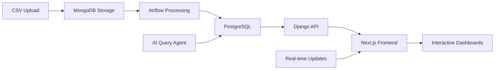

# SupplyWise AI - Enterprise Business Intelligence Platform

A comprehensive, multi-tenant business intelligence platform designed for modern organizations. This system provides secure data isolation, advanced analytics, AI-powered insights, and role-based access control for enterprise supply chain management and business intelligence.

---

## 🚀 Platform Overview

SupplyWise AI is a **production-ready, enterprise-grade platform** that combines:

- **🏢 Multi-Tenant Architecture** - Complete data isolation between organizations
- **🔐 Role-Based Access Control (RBAC)** - Granular permissions and user management
- **📊 Advanced Analytics** - Real-time dashboards with interactive visualizations
- **🤖 AI-Powered Insights** - Natural language query agent and machine learning
- **🔄 Automated Data Pipelines** - ETL workflows with Apache Airflow
- **📱 Modern Web Interface** - Responsive Next.js frontend with TypeScript

---

## 🏗️ Architecture

### Frontend Stack
- **Next.js 15** with TypeScript and React 19
- **Tailwind CSS** for modern, responsive design
- **Recharts** for advanced data visualizations  
- **Radix UI** and **Headless UI** for accessible components
- **NextAuth.js** for authentication
- **Zustand** for state management
- **Framer Motion** for animations

### Backend Stack
- **Django 5.1** with Django REST Framework
- **PostgreSQL** for relational data storage
- **MongoDB** for document storage and raw data ingestion
- **Apache Airflow** for workflow orchestration
- **MinIO** for object storage
- **Ollama** for AI/ML capabilities

### Infrastructure
- **Docker & Docker Compose** for containerization
- **NGINX** reverse proxy support
- **Redis** for caching and sessions
- **Multi-environment** configuration support

---

## ✨ Key Features

### 🔐 Enterprise Security
- **Multi-tenant data isolation** - Organizations cannot access each other's data
- **Hierarchical role system** - Admin, Owner, CEO, Managers, Employees, Clients
- **Object-level permissions** - Fine-grained access control
- **Audit logging** - Complete activity tracking
- **Secure API endpoints** - JWT-based authentication

### 📊 Advanced Analytics
- **Real-time dashboards** - Interactive charts and KPI widgets
- **Modular analytics** - Drag-and-drop dashboard builder
- **Data grid system** - Dynamic table views with filtering/sorting
- **Custom visualizations** - Bar, line, pie charts with real data
- **Export capabilities** - CSV, Excel data export

### 🤖 AI-Powered Features
- **Natural language queries** - Ask questions about your data in plain English
- **Query agent** - Intelligent SQL generation from natural language
- **Demand forecasting** - Machine learning predictions
- **Anomaly detection** - Automated insights and alerts

### 🔄 Data Pipeline
- **Automated ingestion** - Watch folders for new CSV files
- **Data transformation** - Clean and normalize data with Airflow DAGs
- **Schema mapping** - Flexible data structure handling
- **Real-time processing** - Event-driven data updates

### 👥 User Management
- **Organization management** - Create and manage multiple organizations
- **Role-based invitations** - Secure user onboarding workflow
- **Team collaboration** - Share dashboards and insights
- **User activity tracking** - Monitor platform usage

---

## 🚀 Quick Start

### Prerequisites
- Docker & Docker Compose
- Git

### Installation

1. **Clone the repository**
```bash
git clone https://github.com/vcovelli/supply-chain-dashboard.git
cd supply-chain-dashboard
```

2. **Set up environment**
```bash
# Copy environment template
cp .env.example .env

# Edit environment variables
nano .env
```

3. **Start the platform**
```bash
# Build and start all services
docker compose up -d --build

# Wait for services to initialize (2-3 minutes)
docker compose logs -f
```

4. **Initialize test data**
```bash
# Set up test organization and users
docker compose exec backend python manage.py setup_test_org
```

5. **Access the platform**
- **Frontend**: http://localhost:3000
- **Backend API**: http://localhost:8000
- **Airflow**: http://localhost:8080
- **MinIO Console**: http://localhost:9001

### Test Accounts
| Email | Role | Password | Capabilities |
|-------|------|----------|-------------|
| `owner@test.com` | Owner | `testpass123` | Full organization management |
| `manager@test.com` | Manager | `testpass123` | User invites, analytics |
| `employee@test.com` | Employee | `testpass123` | Analytics access |
| `admin@supplywise.ai` | Platform Admin | `admin123` | Multi-org access |

---

## 📚 Platform Components

### 🎛️ Dashboard & Analytics
- **Executive Dashboard** - High-level KPIs and organizational metrics
- **Operations Dashboard** - Real-time operational data and alerts
- **Custom Analytics** - Build personalized dashboards with drag-and-drop
- **Data Grids** - Interactive tables with advanced filtering and sorting

### 📁 Data Management
- **File Upload System** - CSV, Excel file processing with schema mapping
- **Data Grid Interface** - View and manage uploaded datasets
- **Schema Validation** - Automatic data type detection and validation
- **Data Transformation** - Clean and normalize data automatically

### 🤖 AI Query Agent
- **Natural Language Interface** - Ask questions in plain English
- **SQL Generation** - Automatic query generation from natural language
- **Context Awareness** - Understands your data structure and relationships
- **Interactive Results** - Visualize query results automatically

### ⚙️ Administration
- **Organization Settings** - Configure org-level preferences
- **User Management** - Invite, manage, and assign roles to team members
- **Role Configuration** - Flexible permission system
- **Audit Logs** - Track all platform activities

---

## 📊 Data Flow



1. **Data Ingestion** - Upload CSV files or connect data sources
2. **Raw Storage** - Store unprocessed data in MongoDB
3. **Transformation** - Airflow DAGs clean and normalize data
4. **Structured Storage** - Processed data stored in PostgreSQL
5. **API Layer** - Django REST API serves data with proper permissions
6. **Visualization** - Next.js frontend renders interactive dashboards
7. **AI Enhancement** - Query agent provides natural language interface

---

## 🛠️ Development

### Local Development Setup

1. **Install dependencies**
```bash
# Backend dependencies
cd backend
pip install -r backend-requirements.txt

# Frontend dependencies  
cd ../frontend
npm install
```

2. **Database setup**
```bash
# Run migrations
python manage.py migrate

# Create superuser
python manage.py createsuperuser
```

3. **Start development servers**
```bash
# Backend (Django)
python manage.py runserver

# Frontend (Next.js)
npm run dev
```

### Available Scripts

| Script | Purpose |
|--------|---------|
| `./scripts/linux/local/setup.sh` | Complete local environment setup |
| `./scripts/linux/local/start.sh` | Start all services locally |
| `./scripts/linux/local/stop.sh` | Stop all services |
| `docker compose logs -f [service]` | View service logs |

---

## 🔧 Configuration

### Environment Variables

Key configuration options:

```bash
# Database Configuration
APP_DB_NAME=supplywise_db
APP_DB_USER=supplywise_user
APP_DB_PASSWORD=your_secure_password

# Django Settings
DJANGO_SECRET_KEY=your_secret_key
DJANGO_DEBUG=False
ALLOWED_HOSTS=localhost,127.0.0.1

# MinIO (Object Storage)
MINIO_ROOT_USER=minioadmin
MINIO_ROOT_PASSWORD=minioadmin

# AI Configuration
OLLAMA_HOST=http://ai:11434
```

### Customization

- **Branding**: Update `frontend/public/` assets
- **Styling**: Modify `frontend/tailwind.config.js`
- **API Extensions**: Add new Django apps to `backend/`
- **Data Models**: Extend existing models in respective apps

---

## 📈 Production Deployment

### Docker Production

```bash
# Production build
docker compose -f docker-compose.prod.yml up -d

# SSL/TLS with Let's Encrypt
docker compose -f docker-compose.ssl.yml up -d
```

### Kubernetes

```bash
# Deploy to Kubernetes
kubectl apply -f k8s/
```

### Monitoring

- **Health Checks**: Built-in health endpoints for all services
- **Logging**: Centralized logging with Docker logs
- **Metrics**: Prometheus-compatible metrics available

---

## 🤝 Contributing

1. Fork the repository
2. Create a feature branch (`git checkout -b feature/amazing-feature`)
3. Commit your changes (`git commit -m 'Add amazing feature'`)
4. Push to the branch (`git push origin feature/amazing-feature`)
5. Open a Pull Request

### Development Guidelines

- Follow PEP 8 for Python code
- Use TypeScript for all frontend code
- Write tests for new features
- Update documentation for API changes

---

## 📋 Roadmap

### ✅ Completed Features
- Multi-tenant RBAC system
- Advanced analytics dashboard
- AI-powered query agent
- Automated data pipelines
- Modern web interface

### 🚧 In Progress
- Mobile responsive optimizations
- Advanced ML forecasting models
- Real-time collaboration features

### 🔮 Planned Features
- **Advanced Integrations** - ERP, CRM, and third-party connectors
- **Mobile Application** - Native iOS/Android apps
- **Advanced AI** - Predictive analytics and automated insights
- **Enterprise Features** - SSO, advanced compliance, custom branding

---

## 📄 License

This project is licensed under the MIT License - see the [LICENSE](LICENSE) file for details.

---

## 🙋‍♂️ Support

- **Documentation**: [/docs](/docs) folder contains detailed guides
- **Issues**: Report bugs and request features via GitHub Issues
- **Email**: support@supplywise.ai

---

**Built with ❤️ for modern enterprises seeking intelligent business insights.**